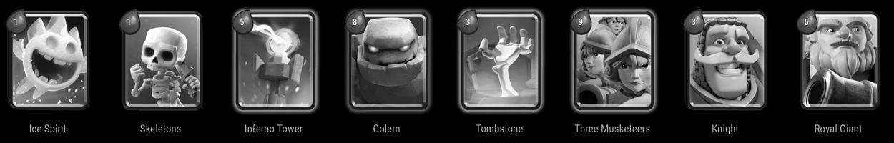

# MMM-Clash-Royale
A [MagicMirror²](https://magicmirror.builders) module to display random Clash Royale decks.

[](https://raw.githubusercontent.com/ianperrin/MMM-Clash-Royale/master/LICENSE)



## Installation

In your terminal, go to your MagicMirror's Module folder:
````
cd ~/MagicMirror/modules
````

Clone this repository:
````
git clone https://github.com/ianperrin/MMM-Clash-Royale.git
````

Add the module to the modules array in the `config/config.js` file:
````javascript
    {
        module: 'MMM-Clash-Royale',
		position: "bottom_bar",
    },
````

## Config Options
| **Option** | **Default** | **Description** |
| --- | --- | --- |
| `updateInterval` | 300000 (5 minutes) | **Optional** How often (in milliseconds) do you want to display a new deck? |
| `animationSpeed` | 1000 | **Optional** The speed (in milliseconds) of the animation between decks. |
| `grayscale` | true | **Optional** Should the card images be shown in grayscale?  |

## Updating

To update the module to the latest version, use your terminal to go to your MMM-Clash-Royale module folder and type the following command:

````
git pull
```` 

If you haven't changed the modules, this should work without any problems. 
Type `git status` to see your changes, if there are any, you can reset them with `git reset --hard`. After that, git pull should be possible.
